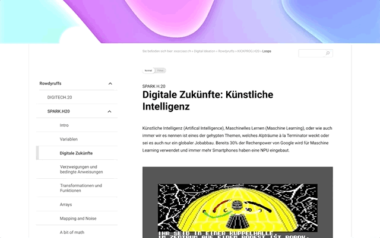

# stuemtec | Project Focus
This is a experimental proof-of-concept for the [Digital Ideation](https://www.hslu.ch/en/lucerne-school-of-information-technology/degree-programs/bachelor/digital-ideation/) Studio Emerging Technologies. The idea is to build a special focus mode for an online learning wiki and add micro animation for an experimental UX. The focus mode should improve the the reading experience, reduce distraction and gain more concentration while reading. For this, we divided the content into chunks, removed many UI elements and created a new hierarchy.

This prototyp was built during three days.



## Project setup
```
yarn install
```

### Compiles and hot-reloads for development
```
yarn serve
```

### Compiles and minifies for production
```
yarn build
```

### Lints and fixes files
```
yarn lint
```
## Deployments

Netlify triggers automatically new deployments for the master branch. The following branch - domain combination is available globally.

| Branch   | Domain                                               |
| -------- | ---------------------------------------------------- |
| `master` | [stuemtec-focus.netlify.app](https://stuemtec-focus.netlify.app) |
